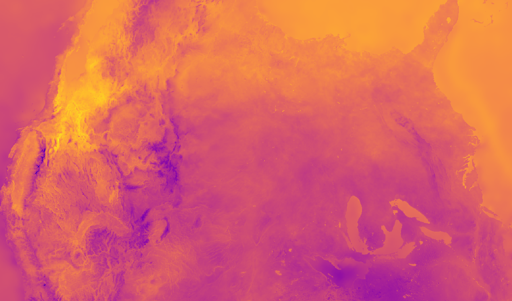
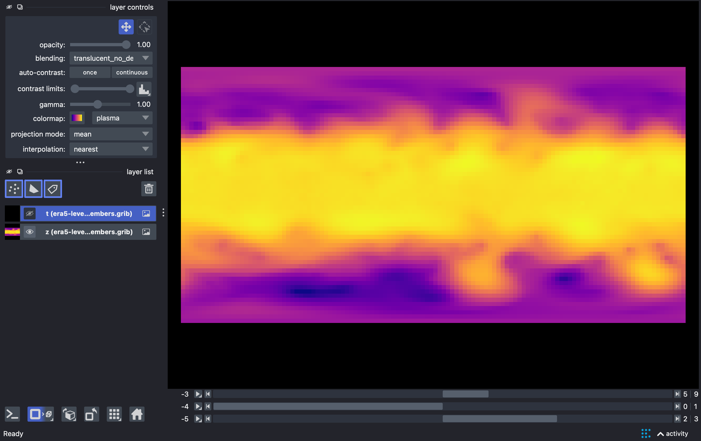
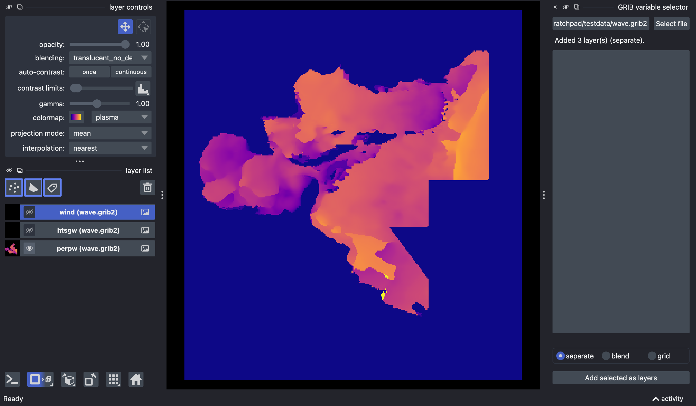
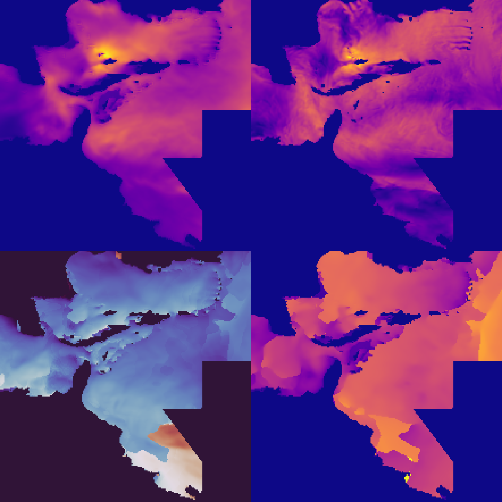

# napari-gribberish

[](https://github.com/ianhi/napari-gribberish/raw/main/LICENSE)
[](https://pypi.org/project/napari-gribberish)
[](https://python.org)
[](https://github.com/ianhi/napari-gribberish/actions)
[](https://codecov.io/gh/ianhi/napari-gribberish)
[](https://napari-hub.org/plugins/napari-gribberish)
[](https://napari.org/stable/plugins/index.html)

Open **GRIB** (GRIB1 / GRIB2) weather and ocean forecast files in [napari], powered by
the fast Rust-based [gribberish] decoder.



> *HRRR 2 m temperature over the continental US — the Rocky Mountains show up cold on the left.*

Every variable in a file becomes an image layer, and any non-spatial dimensions
(forecast time, vertical level, ensemble member, …) become interactive slider axes.

## Features

- 📂 **Reader** — drag-and-drop or `File ▸ Open` any `.grib`, `.grib2`, `.grb`, or
  `.grb2` file. Each variable loads as its own layer with units and long name
  attached, and the horizontal grid mapped to layer `scale`/`translate` when the
  coordinates are regular.
- 🎛️ **Multi-dimensional navigation** — time / level / member dimensions become
  napari sliders, so you can scrub or animate through a forecast.
- 🧭 **Smart colormaps** — sequential fields use `plasma`; directional fields
  (wave/wind direction, 0–360°) get a *cyclic* colormap so 0° and 360° match.
- 🧰 **Variable selector widget** — choose exactly which variables to load and how
  to display them (separate / blended / grid).
- 🌐 **Sample data** — stream a slice of NOAA HRRR straight from the public AWS
  Open Data bucket, showcasing gribberish's remote + indexed reading.

## Installation

```bash
pip install "napari-gribberish[all]"   # includes napari + Qt
```

If you already have napari installed:

```bash
pip install napari-gribberish
```

Latest development version:

```bash
pip install "git+https://github.com/ianhi/napari-gribberish.git"
```

> **Note:** requires napari ≥ 0.8 and Python ≥ 3.12.

## Usage

### Opening a file

Drag a GRIB file onto the napari window, or use `File ▸ Open`. From Python:

```python
import napari

viewer = napari.Viewer()
viewer.open("forecast.grib2", plugin="napari-gribberish")
napari.run()
```

To avoid stacking many opaque layers on top of each other, the reader loads every
variable but reveals only the first — toggle the others with the 👁 icons in the
layer list.

### Multi-dimensional data

Files with extra dimensions (here ERA5 with forecast time × pressure level ×
ensemble member) expose one slider per non-spatial axis. Drag them, or press ▶ to
animate.



### Variable selector widget

`Plugins ▸ GRIB variable selector` opens a dock where you pick a file, select which
variables to load, and choose a display mode:

- **separate** — one layer per variable, only the first visible (best for unrelated fields)
- **blend** — all selected variables visible with additive blending (overlay a few fields)
- **grid** — all selected variables side by side for comparison



Grid mode is handy for comparing related fields at a glance — note the wave-direction
panel (bottom-left) automatically uses a cyclic colormap:



### Sample data

`File ▸ Open Sample ▸ Gribberish ▸ HRRR surface (remote)` streams 2 m temperature and
10 m wind gust from the public NOAA HRRR archive on AWS (requires network access).

### Reading GRIB without napari

The plugin is a thin layer over gribberish's xarray backend, so the same files open
directly with:

```python
import xarray as xr

ds = xr.open_dataset("forecast.grib2", engine="gribberish", collapse_groups=True)
```

## Contributing

Contributions are very welcome. Tests can be run with [tox], please ensure
the coverage at least stays the same before you submit a pull request.

```bash
uv run pytest          # run the test suite
uv run napari          # launch napari with the plugin installed
```

## License

Distributed under the terms of the [BSD-3] license,
"napari-gribberish" is free and open source software.

## Issues

If you encounter any problems, please [file an issue] along with a detailed description.

[napari]: https://github.com/napari/napari
[gribberish]: https://github.com/mpiannucci/gribberish
[GRIB]: https://en.wikipedia.org/wiki/GRIB
[copier]: https://copier.readthedocs.io/en/stable/
[BSD-3]: http://opensource.org/licenses/BSD-3-Clause
[napari-plugin-template]: https://github.com/napari/napari-plugin-template
[file an issue]: https://github.com/ianhi/napari-gribberish/issues
[tox]: https://tox.readthedocs.io/en/latest/
[pip]: https://pypi.org/project/pip/
[PyPI]: https://pypi.org/
